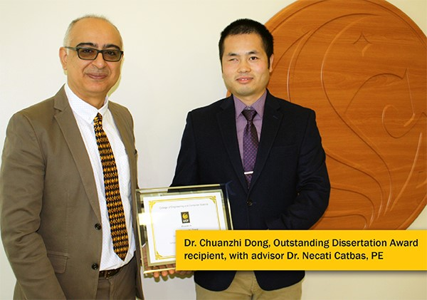

<table>
  <tr>
    <th><a href="https://chuanzhidong.github.io/about/">About Me</a></th>
    <th><a href="https://chuanzhidong.github.io/resume/">Resume</a></th>
    <th><a href="https://chuanzhidong.github.io/publications/">Publications</a></th>
    <th><a href="https://chuanzhidong.github.io/photovisuals/">Photos</a></th>
    <th><a href="https://www.linkedin.com/in/chuanzhidong">LinkedIn</a></th>
    <th><a href="https://scholar.google.com/citations?user=Xs_dNn4AAAAJ&hl=en&authuser=1">Google Scholar</a></th>
    <th><a href="https://www.researchgate.net/profile/Chuan_Zhi_Dong">ResearchGate</a></th>
  </tr>
</table>

* 2019 UCF CECS Outstanding Dissertation Award (Left: My PhD Advisor Prof. F. Necati Catbas, Right: me, Dr. Chuanzhi Dong)

* Super Long Distance Bridge Monitoring using Camera and Computer Vision (Left: My PhD Advisor Prof. F. Necati Catbas, Right: me, Dr. Chuanzhi Dong, at Osman Gazi Bridge, Turky, 2018)

<table>
  <tr>
    <th><a href="https://chuanzhidong.github.io/about/">About Me</a></th>
    <th><a href="https://chuanzhidong.github.io/resume/">Resume</a></th>
    <th><a href="https://chuanzhidong.github.io/publications/">Publications</a></th>
    <th><a href="https://chuanzhidong.github.io/photovisuals/">Photos</a></th>
    <th><a href="https://www.linkedin.com/in/chuanzhidong">LinkedIn</a></th>
    <th><a href="https://scholar.google.com/citations?user=Xs_dNn4AAAAJ&hl=en&authuser=1">Google Scholar</a></th>
    <th><a href="https://www.researchgate.net/profile/Chuan_Zhi_Dong">ResearchGate</a></th>
  </tr>
</table>